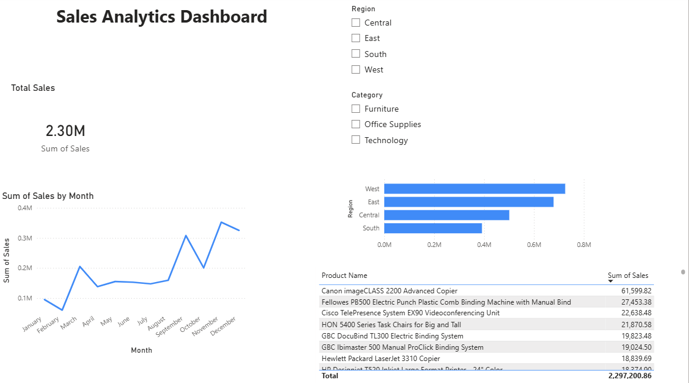

# 📊 Sales Analytics Dashboard — Power BI

## 📸 Dashboard Preview

---

## 📌 Project Overview
An interactive **Sales Analytics Dashboard** built using **Power BI Desktop**
on the popular Superstore dataset (9,994 records).
This dashboard provides actionable business insights through
dynamic visuals and interactive filters.

---

## 🎯 Visuals Built
| Visual | Type | Purpose |
|--------|------|---------|
| Total Sales | KPI Card | Shows overall revenue ($2.30M) |
| Monthly Trend | Line Chart | Sales pattern across 12 months |
| Sales by Region | Bar Chart | Compare East/West/Central/South |
| Top Products | Table | Best selling products by revenue |
| Region Filter | Slicer | Filter entire dashboard by region |
| Category Filter | Slicer | Filter by Furniture/Tech/Office |

---

## 💡 Key Insights
- 🏆 **West region** leads all regions with ~$730K in sales
- 📈 **Sales grew** from $480K (2014) to $730K (2017)
- 🎄 **November–December** peak due to holiday season demand
- 🖨️ **Canon imageCLASS 2200** is the #1 selling product ($61,599)
- 💼 **Technology** category drives highest revenue

---

## 🛠️ Tools & Technologies
- **Power BI Desktop** — Dashboard creation
- **Power Query** — Data cleaning & transformation
- **DAX** — Data Analysis Expressions
- **Dataset** — Superstore Sales (Kaggle)

---

## 📂 Files in this Repository
| File | Description |
|------|-------------|
| `Sales Analytics Dashboard.pbix` | Power BI project file |
| `Sales_Dashboard_Screenshot.png` | Dashboard preview image |
| `Sample - Superstore.csv` | Raw dataset used |

---

## 🚀 How to Open
1. Download and install **Power BI Desktop** (free)
2. Clone/download this repository
3. Open `Sales Analytics Dashboard.pbix` in Power BI Desktop
4. Explore the interactive dashboard!

---

## 👨‍💻 Author
**Sourabh Saxena**
B.Tech CSE (AI-ML) | IMS Engineering College
[LinkedIn](#) | [GitHub](#)
